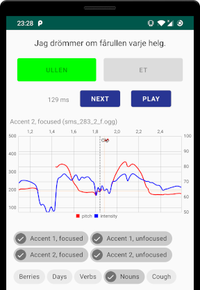

# Tonaccenter

An Android app for the study of Swedish tonal word accents.

It uses the audio files and metadata distributed as part of the [Language
Melody Game](https://projekt.ht.lu.se/lmg) (_Språkmelodispelet_) which was
developed at a research project at Lund University, but this app is not
associated with that research project and does not share any code with the
official game.

The app has a bare-bones version of the core gameplay, with neither levels,
scoring, nor jumping dinosaurs.  It allows filtering of the available sentences
by accent types and focus levels, as well as by word categories.  Additionally,
it displays a plot showing the pitch and the intensity of the recording
(obtained from [Praat](http://www.fon.hum.uva.nl/praat/)) around the cut off
point.

## Installation

The app itself can be built and installed with Android Studio as normal, but
the code is quick-and-dirty, and as such it needs the audio files, pitch and
intensity data, and the metadata database to be generated and pushed to the
device manually using the following process:

1. Install [Praat](http://www.fon.hum.uva.nl/praat/) and
   [Parselmouth](https://github.com/YannickJadoul/Parselmouth).

2. Download the Windows version of
   [Språkmelodispelet](https://projekt.ht.lu.se/lmg/downloads/) and unzip the
   file.

3. Convert the OGG files under `res/audio` in the extracted zip file to WAV so
   that Praat can analyse them, and then extract the pitch and intensity
   information using Parselmouth:

        $ parallel -v oggdec {} -o {}.wav ::: *.ogg
        $ parallel -v tools/wav2pitch.py {} ::: *.wav

4. Convert the sentence metadata and the pitch and intensity information to the
   app's database format:

        $ tools/sentences.py Melodispelet_Win32/

5. Push the OGG files and the database to your device via ADB:

        $ adb shell
        device$ mkdir -p /sdcard/Android/obb/se.whitchurch.tonaccenter/
        $ adb push sentences.db /sdcard/Android/obb/se.whitchurch.tonaccenter/
        $ adb push audio/*.ogg /sdcard/Android/obb/se.whitchurch.tonaccenter/

## License

For the license of the code, see [LICENSE](LICENSE).

The sound files and metadata are not distributed in this repository.  For their
licensing terms, see [Lund University's
website](https://projekt.ht.lu.se/lmg/downloads/).
